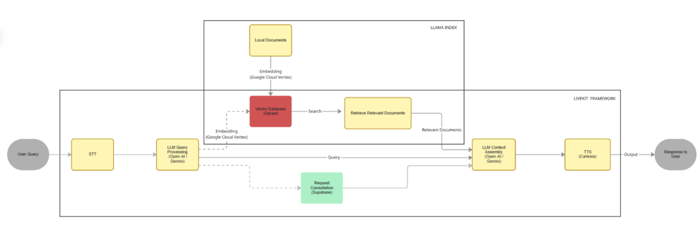

<a href="https://proctrail.com/">
  
</a>

# LiveKit RAG Voice Agent Demo

GitHub: [https://github.com/jorgejarne/livekit-rag-voice-agent-demo](https://github.com/jorgejarne/livekit-rag-voice-agent-demo)

This repository contains a simplified, opinionated reference implementation of a real-time voice agent that combines LiveKit Agents with a Retrieval-Augmented Generation (RAG) layer.

It was built as an internal project at an AI automation agency to explore how RAG behaves in low-latency, voice-first scenarios. The goal is to demonstrate patterns and trade-offs for production-ready designs without exposing client secrets or full production code.

> **Medium article:** [Read the full story here](https://medium.com/@jorge.jarne/lessons-from-implementing-rag-in-a-real-time-voice-agent-livekit-43f0689bf565)

## At a glance

* Purpose: demonstrate how to combine LiveKit Agents with an explicit RAG pipeline for support-style voice workflows and booking flows
* Not a turnkey product: this repo is a sanitized demo for learning and prototyping
* Key components: LiveKit for real-time media, Qdrant as vector DB, LlamaIndex as retriever orchestration, and an LLM for reasoning

## What this demo is

* A reproducible reference for orchestration patterns in voice + RAG
* A minimal demo showing how retrieval and prompt orchestration can work in real time
* A safe, sanitized example that links reasoning to retrieval without shipping secrets

## What this demo is not

* Not production-ready code
* Not a complete customer support system
* Not the full set of integration logic you would use in a client project

## Quick highlights

* LiveKit rooms manage audio, events, and agent lifecycle
* RAG is used for dynamic knowledge that is too large for a system prompt
* The orchestrator decides when to call the retriever and when to rely on system prompts
* A small booking flow demonstrates outbound actions via Supabase + Resend (email)

## Architecture (high level)

Notes:

* Keep the retriever logic explicit in your code so you control costs, errors, and caching
* System prompts should encode persona, safety, and invariant behavior, not large knowledge

## What to look for in this repo

* `src/` - orchestrator and demo agent code (simplified, pseudocode in places)
* `scripts/seed_docs.py` - simple seeding utility to push demo documents into Qdrant
* `ARCHITECTURE.md` - deeper notes on decisions, trade-offs, and deployment considerations
* `env.example` - environment variables required to run the demo

## Dev setup

1. Clone the repo

```bash
git clone https://github.com/jorgejarne/livekit-rag-voice-agent-demo
cd livekit-rag-voice-agent-demo
```

2. Create and activate a Python virtual environment, then install dependencies

```bash
python -m venv .venv
source .venv/bin/activate   # macOS / Linux
.\.venv\Scripts\activate  # Windows PowerShell
pip install -r requirements.txt
```

3. Copy `env.example` to `.env.local` and fill in required keys

Required env variables (examples):

* LIVEKIT_URL
* LIVEKIT_API_KEY
* LIVEKIT_API_SECRET
* QDRANT_URL
* QDRANT_API_KEY
* EMBEDDING_MODEL_NAME
* LLM_PROVIDER_API_KEY
* SUPABASE_URL
* SUPABASE_SERVICE_ROLE_KEY
* RESEND_API_KEY

4. Seed demo documents into Qdrant

```bash
python scripts/seed_docs.py --source docs/company_info.docx
```

## Run the agent

Download required assets for the turn detector and VAD if needed:

```bash
python src/agent.py download-files
```

Run the agent in console mode to test locally:

```bash
python src/agent.py console
```

Run the dev server for use with a frontend or telephony:

```bash
python src/agent.py dev
```

Start for production-style run:

```bash
python src/agent.py start
```

## Implementation notes and guidelines

* Keep system prompts focused on persona, safety, conversation flow, and invariant rules
* Use RAG for large or frequently changing knowledge only
* Chunk by semantic topic or question-answer pairs for better retrieval results
* Ensure embedding dimension matches Qdrant collection configuration
* Cache retrievals for a short time window to reduce repeated vector searches for the same session
* Add provenance when presenting retrieved facts to users to reduce hallucination risk
* Rate limit and batch LLM calls where possible to control latency and cost

## Common pitfalls we found

* Running heavy embedding models inside the LiveKit container caused timeouts. Use an external embedding service or separate microservice.
* Vector dimension mismatch between the embedding model and Qdrant will break similarity search. Confirm sizes before seeding.
* Using opaque file search features hides control and cost. Explicit RAG calls are easier to monitor and debug.
* Collecting reliable user emails required validation and task-level enforcement. The LLM will sometimes skip asking or record incorrect addresses.
* Calendar booking often requires a paid plan on third party services. Using Google Calendar API is a viable programmatic option.

## Testing and evaluation

This demo does not include a full test suite. The LiveKit Agents testing and eval framework is compatible with this repo and can be used to create integration tests. See `AGENTS.md` for guidance.

## Publishing checklist

Before making this repo public:

* Remove secrets from the repo and ensure `.env.local` is ignored
* Use environment variables for credentials
* Rotate any keys that were ever committed
* Mark integration tests as opt-in when they require network credentials

## Links and references

* LiveKit Agents docs: [https://docs.livekit.io/agents](https://docs.livekit.io/agents)
* LlamaIndex: [https://gpt-index.readthedocs.io](https://gpt-index.readthedocs.io)
* Qdrant: [https://qdrant.tech](https://qdrant.tech)
* LiveKit Cloud: [https://cloud.livekit.io](https://cloud.livekit.io)

## License

This project is licensed under the MIT License. See LICENSE for details.

## Contact

If you have questions or want a deeper walkthrough, email [jorge.jarne@proctrail.com](mailto:jorge.jarne@proctrail.com) or open an issue in this repo.
